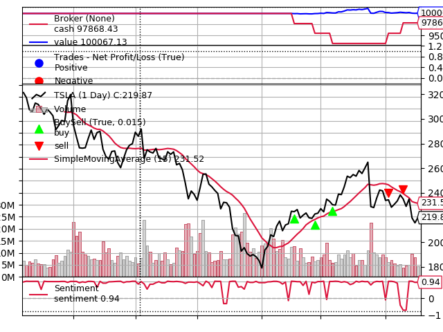

# stock-news-trading

## About This Project

This project is an attempt to see whether or not trading based solely on knowledge of moving averages and NASDAQ news articles can be a viable strategy (spoiler: it's not).

## How It Works

The script crawls the NASDAQ website and scrapes any news article that mentions the company name at least five times. A sentiment score is calculated for each article using VADER analysis (extended with words from a stock lexicon and the Loughran and McDonald Sentiment Word Lists). During backtesting, buy orders are placed if the closing price is above the moving average and sentiment has increased by 0.5, and sell orders are placed if the closing price is below the moving average and sentiment has decreased by 0.5. Orders are executed on the next trading day, with 10 shares being traded in every order (position is capped at 50 shares to prevent overbuying).

## Current Goals

- Design a front end to make this project more user-friendly
- Resolve occassional connection issues with multithreaded requests

## Demo

Below is a demo with Tesla (TSLA) stock, which is known for its volatility:

(February 5, 2019 - August 16, 2019, 15 day moving average)

The test results are promising (started with $100,000 and ended with $100,067), but the reality of the stock market is far more complicated than the scope of this project, and I would be way in over my head to expect this model to reliably turn a profit. This strategy could definitely be improved by including better indicators (RSI, OBV, etc.) and refining the sentiment analysis datasets, so I won't be trusting it with my money anytime soon.
